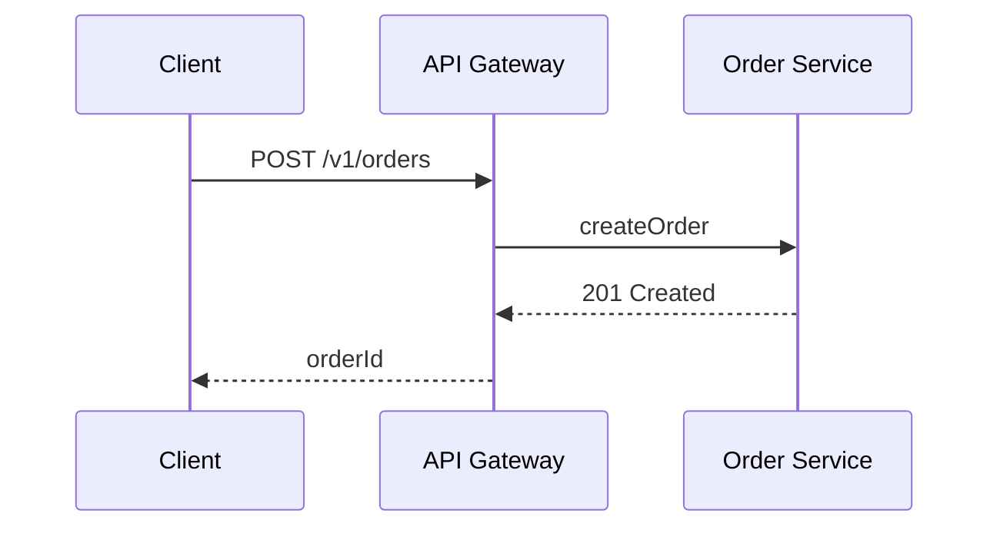
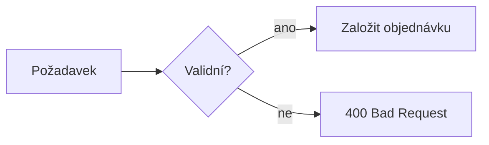
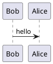

# Testovací dokument

Slouží k ověření, že build funguje — obsahuje všechno, co má náhled umět.
Po instalaci ho otevři dvojklikem a projdi shora dolů.

Úvodní odstavec s **tučným**, *kurzívou*, ~~škrtnutím~~ a `inline kódem`.

## Tabulka GFM

| Endpoint | Metoda | Auth | Poznámka |
|---|---|---|---|
| `/v1/orders` | POST | Bearer | Založení objednávky |
| `/v1/orders/{id}` | GET | Bearer | Detail objednávky |
| `/v1/orders/{id}/cancel` | POST | Bearer | Storno |

## Task list

- [x] Návrh API
- [ ] Sekvenční diagram
- [ ] Review

## Kód

```typescript
interface OrderRequest {
  customerId: string;
  items: Array<{ sku: string; qty: number }>;
  currency: 'CZK' | 'EUR';
}
```

```sql
SELECT id, state FROM orders WHERE created_at > now() - interval '1 day';
```

## Mermaid



Flowchart se šipkami `-->` — právě na nich se dřív náhled tiše rozbíjel:



## PlantUML

Vykreslí se jen s nastaveným PlantUML serverem, jinak se zobrazí chybový box —
to je správné chování, ne selhání buildu.



## Matematika

Inline vzorec $E = mc^2$ uprostřed věty, cena je $5 a $10.

$$
\sum_{i=1}^{n} x_i = \frac{n(n+1)}{2}
$$

## Citace

> Systém musí být auditovatelný.
> — bezpečnostní požadavek

## Kontrola sanitizace

Následující tři řádky se musí zobrazit jako neškodný text nebo zmizet.
Pokud vyskočí dialog nebo se cokoli spustí, je to chyba.

<script>window.__pwned = true;</script>

<a href="javascript:window.__pwned3=true">klikni</a>

## Duplicitní nadpis

### Detail

### Detail
